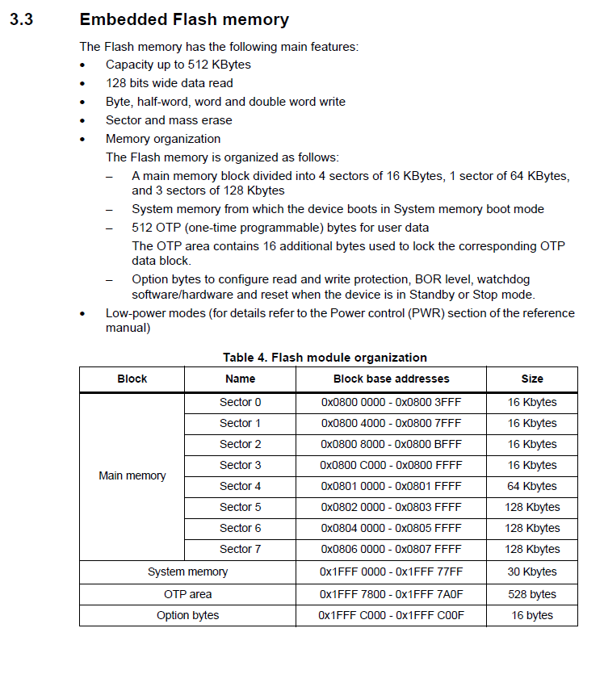
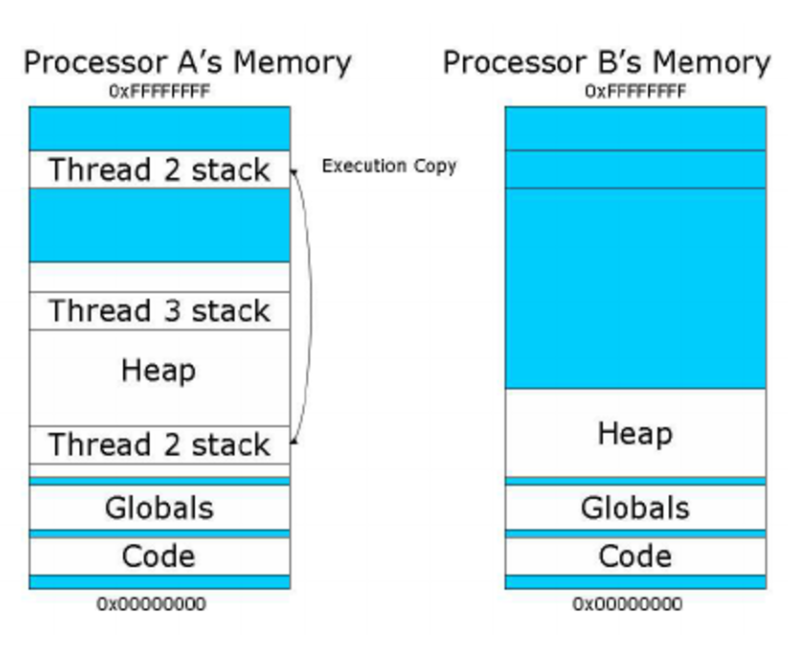
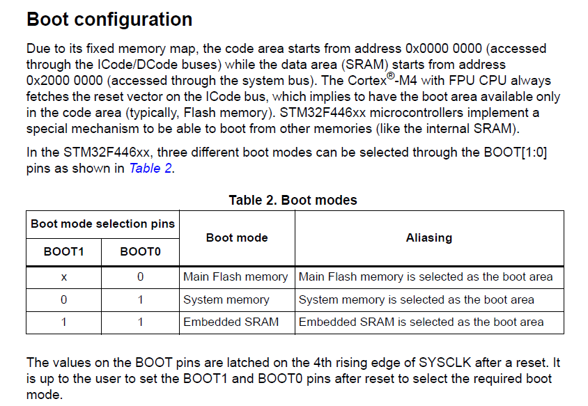

# STME32Fx Microcontroller Custom Bootloader Development

---

## About this Upskilling Process

To learn about Bootloader working method and process inside MCU, to write my own custom bootloader for STM32Fx microcontroller and to test it's operations. To implementation Bootloader Communication. To know about Custom Bootloader command packets and different boot modes of the STM32 microcontroller.

And to know about Boot loader:

- Flash handling implementation (Sector Erase/Program/Mass erase)
- Options bytes(OB) Program handling implementation
- Flash sector protection status handling implementation
- In application programming implementation (IAP)
- Vector table relocation of ARM cortex Mx processor

---

## The Logical Phase of the Whole Process

- **About Bootloader**
- **MCU memory, Reset Sequence and Boot configs**
- **Exploring STM32 Native Bootloader**
- **Custom Bootloader Communication with Host**
- **Boot-Loader :**
  - Project Creation
  - UART Testing
  - Jumping to User Code
  - Read Commands from Host
- Implementing :
  - BL_GET_VER_CMD
  - BL_GET-HELP_CMD
  - BL_GET_CID_CMD
  - BL_GET_RDP_LEVEL_CMD
  - BL_GET_GO_TO_ADDR_CMD
  - BL_FLASH_ERASE_CMD
  - BL_MEM_WRITE_CMD
- **Options Bytes and Flash Sector protection**
- **Exploring Host Application**

---

> ***Let's Begin the Journey***

## Bootloader and Development Keywords

- In-Circuit Debugger/Programmer (ICDP)
- In-Circuit Debugger (ICD)
- In Application Programming (IAP)
- In System Programming (ISP)
- Falsh Memory
- SRAM1-SRAM2 Memory
- System Memory
- OTP memory
- Option Bytes Memory
- Backup RAM
- ROM
  
---

## *About Bootloader*

> ***Bootloader***
> A Bootloader is nothing but a small piece of code stored in the MCU flash or ROM to act as an application loader as well as a mechanism to update the applications whenever required.

The Application of the bootloader is to download and upload binaries in to MUC.

Though STM32 Nucleo has ICDP with in its frame work, still we can use its bootloader sitting inside the MCU itself to download and upload the application binary into the flash memeory to execute the instructions.

---

## MCU memory, Reset Sequence and Boot configs

### ***STM32F446xx Memory Organixation***

>- **Internal Flash memory** also called as ***Embedded Flash memory*** of 512KB (on-chip Flash)
>- **Internal SRAM1** of 112KB
>- **Internal SRAM2** of 16KB
>- **System Memory (ROM)** of 30KB (Read only memory where bootloader get stored)
>- **OTP memory** of 528 bytes (One Time Programable Memory)
>- **Option bytes memory** of 16bytes
>- **Backup RAM** of 4KB (can hold the data using battery)

``` Markdown
NOTE:
  The F4 Series MCU are High Performance Microcontroller, so their pricce is high and their target is high end applications.
```

#### **Detail Orientation of Various Memory :**

***- Internal Flash Memory***

- Size is 512KB
- Begins @ 0x0800 0000 (Base Address)
- Ends @ 0x0807 FFFF (End Address)
- Used to store your application code and read only data of the program, vector table.
- Non volatile

***- Internal SRAM1***

- Size is 112KB
- Begins @ 0x2000_0000 (Base Address)
- Ends @ 0x2001_BFFF (End Address)
- Used to store your application global data, static variables
- Also used for Stack and Heap purpose
- Volatile
- You can also execute code from this memory
  
***- Inteernal SRAM2***

- Size is 16KB
- Begins @ 0x2001_C000 (Base Address)
- Ends @ 0x2001_FFFF (End Address)
- Used to store your application global data, static Variables
- Also can be used for Stack and Heap Purpose
- Volatile
- You can also execute code from this memory

***- System Memory (ROM)***

- Size is 30KB
- Begins @ 0x1FFF_0000 (Base Address)
- Ends @ 0x1FFF_77FF (End Address)
- All the ST MCUs store **Bootloader** in this memeory
- This memory is Read Only
- **By default MCU will not execute any code from this memory but you can configure MCU to boot or execute boolader from this memeory**.
  
***- Flash module Organization***

>- **Main Memory** ( On Chip Flash)
>
>>- **Sector 1** => 0x0800_0000 - 0x0800_3FFF => 16 Kbytes
>>- **Sector 2** => 0x0800_4000 - 0x0800_7FFF => 16 Kbytes
>>- **Sector 3** => 0x0800_8000 - 0x0800_BFFF => 16 Kbytes
>>- **Sector 4** => 0x0800_C000 - 0x0800_FFFF => 64 Kbytes
>>- **Sector 5** => 0x0801_0000 - 0x0801_FFFF => 128 Kbytes
>>- **Sector 6** => 0x0802_0000 - 0x0803_FFFF => 128 Kbytes
>>- **Sector 7** => 0x0804_0000 - 0x0805_FFFF => 128 Kbytes
>
>- **System memory** => 0x1FFF_0000 - 0x1FFF_77FF => (30 Kbytes)
>- **OTP area** => 0x1FFF_7800 - 0x1FFF_7A0F => (528 bytes)
>- **Option bytes** => 0x1FFF_C000 - 0x1FFF_C00F (16 bytes)

#### ***Exaple for Flash Module Organization from STM32 Nucleo***



---

### ***Understanding: Reset Sequence and memory Aliasing of the MCU***

>- When we reset the MCU, the PC of the processor is loaded with the value 0x0000_0000
>- Then processor reads the value @ memory location 0X0000_0000 in to MSP (Main Stack Pointer)
>
  >>- MSP = value@0x0000_0000
  >>- MSP is a Main Stack Poniter register
  >>- That means, processor first initialize the stack pointer register.
>
>- After that, processor reads the value @ memory location 0x0000_0004 in PC. The address 0x0000_0004 is the address of reset handler.
>- Pc jumps to the reset handler
>- A reset handler is just a C or assembly function written by you to carry out any initializions required.
> - From reset handler you call your main() function of the application.

***Memory Aliasing***

  **Bothe Addresses can be linked with the techinque called "memory aliasing" and it depends on the MCU.**



---

### Boot Configuration of the MUC

 

Boot Mode Selection in STM :

- Boot Mode Selection Pins :
  - **BOOT1**
  - **BOOT0**
- If **BOOT0** is **LOW** nad **BOOT1** pin is **dont care**, The MCU will boot from **Main Flash memeory**.
- If **BOOT1** is **LOW** and **BOOT0** is **HIGH** the MCU will boot from **System memory** is selected as the boot area.
- If **BOOT1** is **HIGH** and **BOOT0** is **HIGH** the **EMbedded SRAM** will be selected as the boot area.

---

## ***Exploring STM32 Native Bootloader***

### *Activating ST's Bootloader*

>By Default MCU will not execute any code from System Memory(ROM) but we can configure MCU to boot or execute bootloader from this memory.
